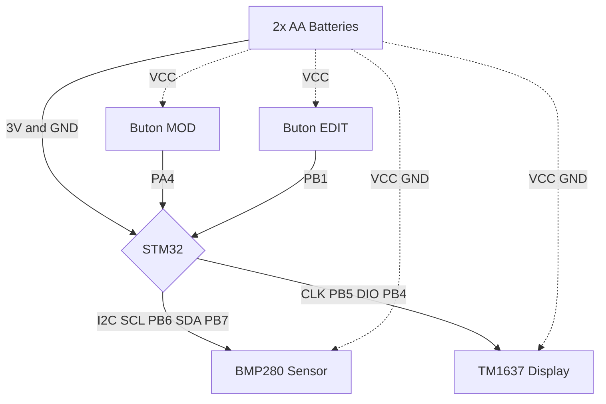

# Altimeter STM32F103C8
A simple altimeter built with an STM32F103C8T6 and a BMP280 sensor. The MCU reads pressure data over the I2C bus, calculates the current altitude in meters, and displays the result on a 7-segment (TM1637) display. Includes additional features such as temperature and pressure reading modes.

## Features
- 2 buttons for switching between modes and modify sea level pressure.
- Functional altimeter mode, calculated with pressure difference between manually inputted sea level pressure.
- Temperature (in Celsius) reading mode.
- Pressure (in millibars) reading mode.

## Images
## Altimeter Modes (Meters)

## Showing Pressure (Millibars)

## Showing Temperature (Celsius Degrees)

### Demo Videos
- **[Project Walkthrough (YouTube)](https://www.youtube.com/watch?v=ruwWq_uKEkQ)** - Detailed explanation of the implementation (in Turkish).
- **[Live Demo (Shorts)](https://www.youtube.com/shorts/OypFeyjmf-c)** - Quick look at the altimeter features in action.

## Bill of Materials (BOM)
| Component | Low Estimate (Target) | High Estimate (Local/Branded) |
| :--- | :--- | :--- |
| **STM32F103C8T6** | $3.50 | $8.00 |
| **BMP280 Sensor** | $1.50 | $5.00 |
| **TM1637 Display** | $1.50 | $4.50 |
| **2x AA Batteries** | $1.00 | $2.00 |
| **Pertinax Board (6x8 cm)** | $0.50 | $2.00 |
| **Consumables (Wire, Solder)**| $1.00 | $4.00 |
| **Total** | **$9.00** | **~$25.50** |

## Schematic

## Project Status: Archived / Prototype
This project served as a proof-of-concept for the Embedded Systems course, focusing on I2C communication, GPIO manipulation, and system integration on the STM32F103.
### Known Limitations & Retrospective:
**Calibration:** The sensor data is raw. No compensation algorithms or unit tests were implemented.

**Hardware Stability:** The prototype relies on a pertinax (perfboard) circuit. Mechanical instability and signal integrity issues (short/open circuits) occasionally cause the display to freeze, likely due to I2C bus lockups.

**Next Steps:** Future iterations would require a custom PCB design to resolve these mechanical reliability issues.
