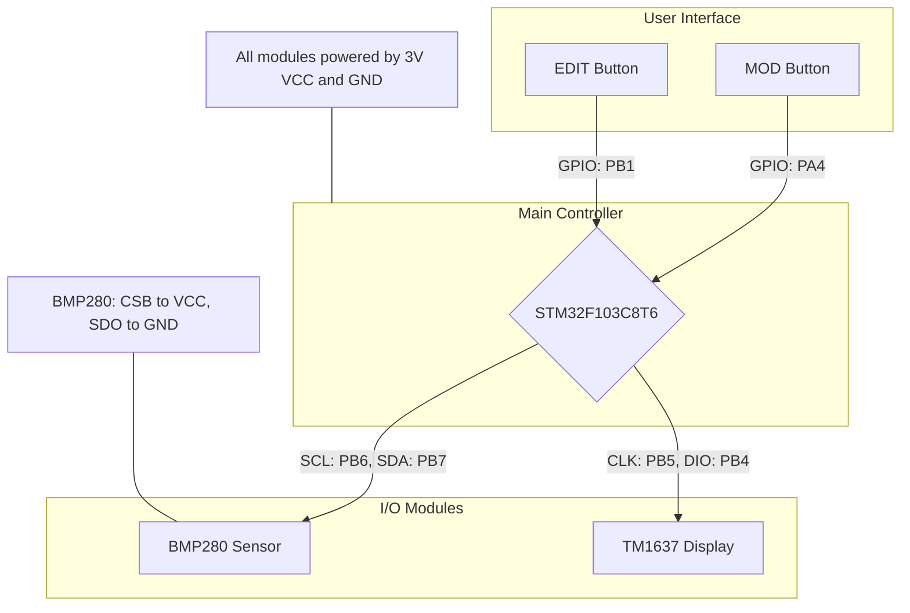

# Altimeter STM32F103C8
A simple altimeter built with an STM32F103C8T6 and a BMP280 sensor. The MCU reads pressure data over the I2C bus, calculates the current altitude in meters, and displays the result on a 7-segment (TM1637) display. Includes additional features such as temperature and pressure reading modes.

## Features
- 2 buttons for switching between modes and modify sea level pressure.
- Functional altimeter mode, calculated with pressure difference between manually inputted sea level pressure.
- Temperature (in Celsius) reading mode.
- Pressure (in millibars) reading mode.

## Potential Use Cases
- Weather balloons.
- Aviation and aircrafts.
- Mountaineering, skydiving and such extreme sports.

## Images
## Altimeter Modes (Meters)

## Showing Pressure (Millibars)

## Showing Temperature (Celsius Degrees)

### Demo Videos
- **[Project Walkthrough (YouTube)](https://www.youtube.com/watch?v=ruwWq_uKEkQ)** - Detailed explanation of the implementation (in Turkish).
- **[Live Demo (Shorts)](https://www.youtube.com/shorts/OypFeyjmf-c)** - Quick look at the altimeter features in action.

## Bill of Materials (BOM)
| Component | Low Estimate (Target) | High Estimate (Local/Branded) |
| :--- | :--- | :--- |
| **STM32F103C8T6** | $3.50 | $8.00 |
| **BMP280 Sensor** | $1.50 | $5.00 |
| **TM1637 Display** | $1.50 | $4.50 |
| **2x AA Batteries** | $1.00 | $2.00 |
| **Pertinax Board (6x8 cm)** | $0.50 | $2.00 |
| **Consumables (Wire, Solder)**| $1.00 | $4.00 |
| **Total** | **$9.00** | **~$25.50** |

## Schematic

```mermaid
graph TD
    %% PROCESSING UNIT
    subgraph MCU [Main Controller]
        STM32{STM32F103C8T6}
    end

    %% INPUTS
    subgraph Inputs [User Interface]
        BTN1[MOD Button] -- "GPIO: PA4" --> STM32
        BTN2[EDIT Button] -- "GPIO: PB1" --> STM32
    end

    %% PERIPHERALS
    subgraph Peripherals [I/O Modules]
        BMP[BMP280 Sensor]
        SCREEN[TM1637 Display]
    end

    %% LOGIC CONNECTIONS (CLEAN FLOW)
    STM32 -- "SCL: PB6, SDA: PB7" --> BMP
    STM32 -- "CLK: PB5, DIO: PB4" --> SCREEN

    %% COMPACT HARDWARE NOTES (FIXED SYNTAX)
    note1["All modules powered by 3V VCC and GND"]
    note2["BMP280: CSB to VCC, SDO to GND"]
    
    note1 --- MCU
    note2 --- BMP
```

## License
This project is licensed under the MIT License - see the [LICENSE](LICENSE) file for details.
